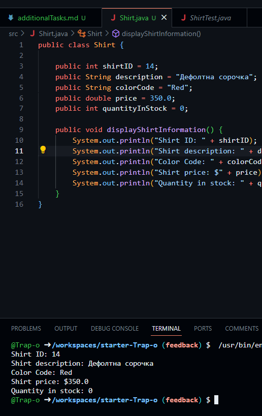
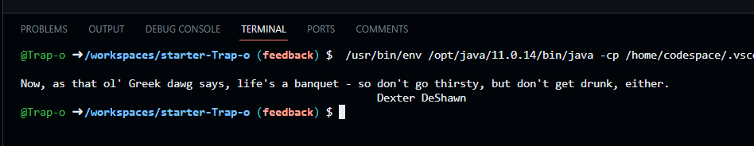

## Завдання на вищий бал

### Завдання 1
#### Колір сорочки зберігається та виводиться у вигляді рядка (red, blue, green, unset)

### Завдання 2
#### Окрім цитати виводиться ім'я того, кому вона належить
